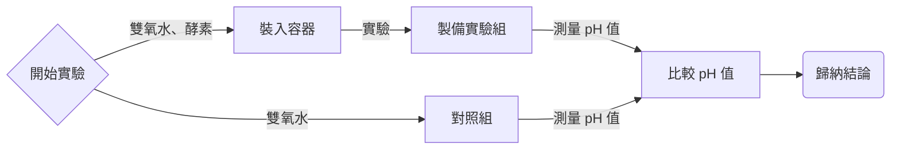

<style>
  .title-top {
    position: absolute;
    top: 0;
    left: 0;
    right: 0;
    text-align: center;
    margin-top: 10px;
  }
</style>

## 雙氧水分解對pH值影響
### 1626 第六組
<font color="#adadad"> **曾嘉禾 程至恆 黃宥程 黃少鈞** </font>

---

### 假說

ph值會因為雙氧水的分解而下降

---

### 實驗流程圖


---

### 實驗組員照片
<div style="display: flex; justify-content: space-around; flex-wrap: wrap;">
        
    
</div>
    
    
    


---


## 結果數據表格

| 實驗次數  | 實驗組             | 對照組  |
|----------|-------------------|--------|
| 1        | 6.3               | 3.3    |
| 2        | 6.3               | 3.3    |
| 3        | 6.4               | 3.3    |
| 4        | 6.4               | 3.3    |
| 5        | 6.9               | 3.3    |
| 平均      | 6.46              | 3.3    |
| SD       | 0.25              | 0      |

---

```vega


{
  "$schema": "https://vega.github.io/schema/vega-lite/v5.json",
  "title": {
    "text": "平均 pH 值",
    "fontSize": 55
  },
  "data": {
    "values": [
      { "組別": "實驗組", "pH 值": 6.46, "stddev": 0.250998007960223 },
      { "組別": "對照組", "pH 值": 3.3, "stddev": 0 }
    ]
  },
  "layer": [
    {
      "mark": { "type": "bar", "width": { "band": 0.4 }, "cornerRadiusEnd": 20 },
      "encoding": {
        "x": {
          "field": "組別",
          "type": "nominal",
          "axis": { "labelAngle": 0, "labelFontSize": 20, "titleFontSize": 30 }
        },
        "y": {
          "field": "pH 值",
          "type": "quantitative",
          "axis": {
            "titlePadding": 50,
            "titleAngle": 0,
            "labelFontSize": 20,
            "titleFontSize": 30
          }
        }
      }
    },
    {
      "mark": "rule",
      "encoding": {
        "x": {
          "field": "組別",
          "type": "nominal"
        },
        "y": {
          "field": "pH 值",
          "type": "quantitative"
        },
        "y2": {
          "field": "pH 值",
          "type": "quantitative"
        },
        "color": {
          "value": "green"
        },
        "strokeWidth": {
          "value": 20
        }
      }
    },
    {
      "mark": "rule",
      "encoding": {
        "x": {
          "field": "組別",
          "type": "nominal"
        },
        "x2": {
          "field": "組別",
          "type": "nominal"
        },
        "y": {
          "field": "pH 值",
          "type": "quantitative"
        },
        "y2": {
          "field": "pH 值",
          "type": "quantitative"
        },
        "color": {
          "value": "lime"
        },
        "strokeWidth": {
          "value": 20
        }
      }
    },
    {
      "mark": "errorbar",
      "encoding": {
        "x": {
          "field": "組別",
          "type": "nominal"
        },
        "y": {
          "field": "pH 值",
          "type": "quantitative"
        },
        "yError": {
          "field": "stddev"
        },
        "color": {
          "value": "lime"
        },
        "strokeWidth": {
          "value": 20
        }
      }
    }
  ],
  "height": 400,
  "width": 600
}

```

---

## 討論

pH 值不但沒有下降，反而上升。
但雙氧水分解本身並不會對 pH 值有直接影響，故推測為外在因素所導致。

---

## 結論

分析可能外在因素後，發現應該是雙氧水分解時催化劑產生的副產物，或是水的生成稀釋了溶液而導致 pH
值上升。

由於可能外在因素的干擾，我們無法得知假說的對錯，應該重新設計實驗。

---

### 分工表

| 組員 | 座號 | 項目 |
| --------------- | --------------- | --------------- |
| 曾嘉禾 | 21 | 簡報、圖表 |
| 陳至恆 | 22 | 簡報、報告 |
| 黃少鈞 | 23 | 簡報 |
| 黃又成 | 25 | 簡報、報告 |

